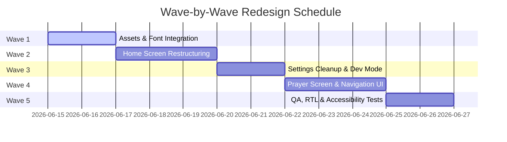

# PHASE 3 – UI/UX REDESIGN MASTER PLAN

Under the supervision of: **Senior Mobile Architect & UI/UX Expert**  
Project: **Mizan Radio (ميزان الراديو)**

---

## Executive Summary

The primary objective of Phase 3 is to transform **Mizan Radio** from a developer-focused, technical streaming application into a premium, world-class Islamic audio experience. The redesign prioritizes:
1. **Aesthetic Wow-Factor:** Captivating visual hierarchy, deep emerald greens, warm gold accents, and fluid micro-animations.
2. **Elderly Accessibility:** High-contrast buttons, legible text sizes, and a sticky layout ensuring the play/pause button is visible immediately upon launch.
3. **Spiritual Serenity:** Traditional Islamic geometric cues combined with clean, modern flat layouts.
4. **Zero Configuration Playback:** A first-time user can start listening to the Cairo Holy Quran Radio in a single tap without scroll searching or network configuring.

---

## 1. Complete Design Audit

A comprehensive screen-by-screen audit of the existing codebase and UI flows revealed **6 critical weaknesses and bugs** that undermine the application's usability and aesthetics.

### Issue 1: Play/Pause Button Cut-off (Critical Layout Bug)
*   **Technical Root Cause:** In [MainActivity.kt](file:///e:/app/radio.qr/app/src/main/java/com/example/MainActivity.kt), the main layout uses a `LazyColumn` container. The brand header banner, date cards, and prayer times cards are loaded sequentially above the play button. Because their combined height exceeds the screen viewport height on standard resolutions, the play controls are pushed off-screen. Only a tiny green sliver of the play button is visible on startup; users must scroll down manually to discover it.
*   **Usability Impact:** First-time and elderly users are confused. Playback is the app's core feature, but it is invisible at startup.
*   **Redesign Solution:** Restructure the screen layout. We will extract the play controls and active audio wave visualizer from the scrollable list and place them in a **sticky bottom playback card** positioned immediately above the bottom navigation bar.

### Issue 2: Arabic Typographic Distortions (Rendering Bug)
*   **Technical Root Cause:** In the Surah list within the Quran screen, titles are formatted with hardcoded diacritics and kashida extensions, specifically `سُـورة` (using a damma and kashida `ـ`). The default Android system font (Roboto/Noto Sans) is unable to process this sequence correctly, merging the `س` with the kashida and rendering it as `ش`. This makes the word read as `شُورة` (Shurah) instead of `سُورة` (Surah).
*   **Usability Impact:** Spelling and typographic errors in holy titles severely degrade the app's professional feel and spiritual authority.
*   **Redesign Solution:** Clean the string resources. Strip all diacritics and kashida symbols from static UI labels, writing them as standard `سورة`. Introduce dedicated high-legibility Google Fonts (Cairo & Amiri) to handle Arabic text correctly.

### Issue 3: Bidirectional RTL Number Reversal (Layout Bug)
*   **Technical Root Cause:** On the morning/evening Adhkar screens, the tap counter displays progress as: `"$localTapCount / ${item.countTarget}"`. When the application runs in RTL mode (enforced via `LocalLayoutDirection`), the bidirectional rendering engine treats the slash `/` as a neutral character, causing it to flip the layout order of the digits. It renders as `Target / Current` (e.g., `1 / 0` when the user has tapped 0 times).
*   **Usability Impact:** Users believe they have already finished their tasbih counts, leading to early termination of prayers.
*   **Redesign Solution:** Format progress using clear, localized Arabic wording like `"$localTapCount من ${item.countTarget}"` (e.g., `0 من 1`), or explicitly force a Left-to-Right direction (`Ltr`) for the number component using Compose layout constraints.

### Issue 4: Preferred Stream Infinite Loading Spinner (Logic/UI Bug)
*   **Technical Root Cause:** [SettingsRepository.kt](file:///e:/app/radio.qr/app/src/main/java/com/example/data/pref/SettingsRepository.kt) sets the default preferred stream URL as `https://stream.radiojar.com/0u5beuqm0uquv`. However, the production database seeds the primary stream URL as `https://stream.radiojar.com/8s5u5tpdtwzuv`. Because they do not match, the query in the Settings viewmodel to fetch the active stream name returns null, leaving the button displaying `جاري التحميل...` (Loading...) forever.
*   **Usability Impact:** The settings screen looks broken, and users cannot change or verify their preferred broadcast.
*   **Redesign Solution:** Align the default preferred stream URL in `SettingsRepository` with the database seed. Add a safety default fallback label (e.g., "المصدر الرئيسي") if the URL does not exist in the database.

### Issue 5: Electronic Subhah Phrase Selection Inconsistency (UI Bug)
*   **Technical Root Cause:** The electronic Tasbih starts with `"سبحان الله وبحمده"` as the selected phrase. However, the four quick-selection chips displayed below are `"سبحان الله"`, `"الحمد لله"`, `"أستغفر الله"`, `"الله أكبر"`. Because the default phrase is not present in the selection list, none of the cards are highlighted initially.
*   **Usability Impact:** The UI lacks visual feedback on startup.
*   **Redesign Solution:** Align the default phrase to be the first available chip (`"سبحان الله"`), or add a custom indicator highlighting the active custom phrase.

### Issue 6: Expanded Diagnostics Logs Layout Overflow (Accessibility Bug)
*   **Technical Root Cause:** The settings screen features an expandable event diagnostics log panel. Since it is nested inside the main scrollable Column, expanding the logs increases the screen height, conflicting with the parent scroll behavior and pushing the log viewer and speed test buttons behind the bottom navigation bar where they cannot be scrolled or tapped.
*   **Usability Impact:** Diagnostic tools are inaccessible on smaller devices, making remote troubleshooting impossible.
*   **Redesign Solution:** Remove technical logs from the consumer Settings screen entirely. Implement a hidden **Developer Mode** screen accessed by tapping the App Version card in Settings 7 times. This opens a dedicated full-screen console.

---

## 2. Home Screen Mockup

### Visual UI Mockup
Below is the design mockup showcasing the clean layout, dates, next prayer card, and the sticky playback controller:


### Layout Hierarchy & Code Architecture (Compose Blueprint)
```kotlin
Box(modifier = Modifier.fillMaxSize().background(BackgroundSoftDark)) {
    // 1. Scrollable Content (Header, Dates, Quick Actions)
    LazyColumn(
        modifier = Modifier.fillMaxSize().padding(bottom = 180.dp), // Leaves room for sticky player
        contentPadding = PaddingValues(16.dp),
        verticalArrangement = Arrangement.spacedBy(16.dp)
    ) {
        item { BrandHeader() }
        item { DateCard(hijri = "29 ذو الحجة 1447 هـ", gregorian = "الأحد، 14 يونيو 2026 م") }
        item { NextPrayerCard(name = "صلاة العصر", time = "3:24 م", countdown = "01:23:45") }
        item { QuickAccessShortcuts() }
    }
    
    // 2. Sticky Playback Controller Card (Always Visible, Floating above bottom bar)
    PlaybackStickyCard(
        modifier = Modifier
            .align(Alignment.BottomCenter)
            .padding(bottom = 80.dp) // Just above the bottom navigation bar
    )
}
```

### Component Details
*   **Live Indicator:** A small glowing green pulsing dot in the top toolbar that turns red/amber during network buffering, informing first-time users of playback readiness.
*   **Next Prayer Card:** Displays the upcoming prayer with a precise countdown timer, giving the user immediate spiritual context.
*   **Sticky Playback Card:** Includes a large 72dp gold circular Play/Pause button and an **Active Audio Waveform Canvas Animation** (12 dynamic bars rising and falling based on player state), indicating that the app is alive and streaming.

---

## 3. Settings Screen Mockup

### Visual Layout
The redesign streamlines settings into three neat, rounded cards, hiding diagnostic clutter:

```
+---------------------------------------------------------+
|                  الإعدادات والخيارات                    |
+---------------------------------------------------------+
|  [ المظهر العام ]                                       |
|  داكن  |  فاتح  |  تلقائي                               |
+---------------------------------------------------------+
|  [ خيارات البث ]                                       |
|  * إعادة الاتصال التلقائي          [ تشغيل / إيقاف ]   |
|  * التشغيل بالخلفية                [ تشغيل / إيقاف ]   |
|  * المصدر الصوتي المفضل: [ الرئيسي - 180ms ] v          |
+---------------------------------------------------------+
|  [ عن التطبيق ]                                         |
|  ميزان الراديو - بث إذاعة القرآن الكريم                 |
|  الإصدار 1.0.0 (بناء 24)   <--- (انقر 7 مرات لتفعيل وضع المطور) |
+---------------------------------------------------------+
```

### Developer Mode Integration
*   **Activation:** Tapping the text "الإصدار 1.0.0" 7 times plays a light haptic tap and unlocks the developer options card.
*   **Developer Panel (لوحة المطورين):**
    *   **أداة قياس استجابة الخوادم (Ping Test):** Runs `testAndRankStreams()` and prints raw latencies.
    *   **عرض السجلات الحية (Live Event Console):** A scrollable terminal displaying connection status, ExoPlayer errors, and failovers.
    *   **إعادة تهيئة القنوات (Factory Reset Database):** Wipes and reinstalls the stream database.

---

## 4. Future Prayer Times Screen Mockup

### Visual Layout
This dedicated screen displays the full daily Cairo schedule, styled with elegant borders and active prayer highlights:

```
+---------------------------------------------------------+
|                     مواقيت الصلاة                       |
|                   القاهرة، جمهورية مصر                  |
+---------------------------------------------------------+
|   [ صلاة الظهر ]  <--- (Current Active Prayer Card)     |
|   المتبقي لصلاة العصر: 01:23:45                          |
+---------------------------------------------------------+
|  الفجر          |   4:12 ص    |   [أيقونة الفجر]        |
|  الشروق         |   5:48 ص    |   [أيقونة الشروق]       |
|  الظهر (نشط)    |  12:05 م    |   [أيقونة الظهر] *نشط*   |
|  العصر          |   3:24 م    |   [أيقونة العصر]        |
|  المغرب         |   6:52 م    |   [أيقونة المغرب]       |
|  العشاء         |   8:20 م    |   [أيقونة العشاء]       |
+---------------------------------------------------------+
```

*   **Styling:** Row elements use soft gold borders. The current active prayer (Dhuhr) is highlighted with an emerald background and a pulsing gold border.
*   **Cairo Calculations:** Handled dynamically via [PrayerTimesCalculator.kt](file:///e:/app/radio.qr/app/src/main/java/com/example/data/repository/PrayerTimesCalculator.kt).

---

## 5. Design System

To construct a visually stunning, spiritually soothing experience, we specify the following cohesive design system token values:

### Color Palette

| Token Name | Light Mode Value | Dark Mode Value | Usage Context |
| :--- | :--- | :--- | :--- |
| **Primary (Emerald)** | `#2E8B57` | `#48BB78` | App brand indicators, active buttons, highlighted prayer states. |
| **Secondary (Gold)** | `#D4AF37` | `#F4D068` | Borders, accents, countdown timers, premium icons. |
| **Background (Mint)** | `#F8FAF7` | `#111613` | Root view backgrounds. Reduces screen glare. |
| **Card (Pine/White)** | `#FFFFFF` | `#18201C` | Screen containers and options grids. |
| **Text Primary** | `#1F2937` | `#F3F4F6` | Title headers, Surah names, settings labels. |
| **Text Secondary** | `#6B7280` | `#9CA3AF` | Captions, dates, inactive counts, elapsed time. |
| **State: Success** | `#22C55E` | `#22C55E` | Online status, successful reconnection alerts. |
| **State: Error** | `#EF4444` | `#EF4444` | Network offline, failed stream source alerts. |

### Contrast & Accessibility (WCAG Compliance)
*   All text layers guarantee a minimum contrast ratio of **4.5:1** against their container backgrounds.
*   Interactive click targets are constrained to a minimum of **48dp x 48dp** to facilitate usage by elderly individuals.

---

## 6. Typography System

To ensure optimal Arabic readability (avoiding system glyph distortions), we recommend a dual-font structure:

### Font Choices
1.  **Cairo (Google Fonts):** A clean, modern geometric Arabic sans-serif. Highly readable at smaller scales. Excellent for buttons, settings, numbers, and system navigation.
2.  **Amiri (Google Fonts):** A premium, classical Naskh font for headings, Quranic texts, Hijri dates, and titles. It brings a traditional, sacred elegance to the app.
3.  **Inter (Google Fonts):** A clean sans-serif used exclusively for English labels, timestamps, and numbers.

### Typographic Scales

| Style Name | Font Family | Weight | Size (sp) | Usage Example |
| :--- | :--- | :--- | :--- | :--- |
| **Header 1** | Amiri | Bold | `24sp` | App Name, Hijri Date Card |
| **Header 2** | Cairo | Semi-Bold | `18sp` | Card Titles, Settings Headers |
| **Body Large** | Cairo | Normal | `16sp` | Surah Names, Adhkar Text, Dialogs |
| **Body Medium** | Cairo | Normal | `14sp` | Subtitles, description fields |
| **Button Text** | Cairo | Bold | `14sp` | Tab names, action labels |
| **Countdown Timer** | Inter | Bold | `32sp` | Next prayer countdown digits |

---

## 7. Application Icon Concept

### Visual Concept Art
Below is the generated vector concept art for the application icon:


### Design Rationale
*   **Crescent & Quran:** A metallic golden crescent frames a clean outline of an open Quran, representing the foundation of the broadcasts.
*   **Radio Signal Waves:** Sleek, minimalist gold signal arcs emerge directly from the center of the Quran, representing digital audio streaming.
*   **Emerald Background:** The icon is set on a dark emerald green rounded square backdrop, ensuring it stands out on the Google Play Store and user home screens.

---

## 8. Navigation Architecture

To keep the application highly intuitive and prevent layout nesting errors, we propose a **4-Tab Bottom Navigation Layout**:

```
                  [ USER FLOW ]
                        │
                        ▼
               ┌─────────────────┐
               │   Splash Boot   │
               └────────┬────────┘
                        │
                        ▼
┌────────────────────────────────────────────────────────┐
│                   Home / Live Player                   │ <─── Default Screen
└───────┬────────────────┬─────────────────┬─────────────┘
        │                │                 │
        ▼                ▼                 ▼
┌──────────────┐ ┌──────────────┐  ┌──────────────┐
│  Quran List  │ │ Prayer Times │  │ Settings Tab │
└──────────────┘ └──────────────┘  └──────┬───────┘
                                          │ (Tap version 7x)
                                          ▼
                                   ┌──────────────┐
                                   │ Developer UI │
                                   └──────────────┘
```

### Bottom Tab Breakdown
1.  **الرئيسية (Home):** Core screen featuring the sticky Play/Pause button, active waveform animation, Hijri calendar, next prayer countdown, and quick-access buttons.
2.  **القرآن والأذكار (Quran & Adhkar):** Combined tab that groups all readings. Includes the Surah list (corrected to standard `سورة`) and Morning/Evening Adhkar (corrected RTL counter layout).
3.  **الصلاة (Prayers):** Full Cairo prayer schedule and notifications settings.
4.  **الإعدادات (Settings):** App configurations, stream quality selector, and the hidden Developer Mode.

---

## 9. Implementation Roadmap

The redesign will be executed in **5 distinct development waves** to ensure maximum stability and zero regressions:



### Wave Details
*   **Wave 1: Assets & Theme Setup**
    *   Import Cairo, Amiri, and Inter Google Fonts.
    *   Set up type tokens in [Type.kt](file:///e:/app/radio.qr/app/src/main/java/com/example/ui/theme/Type.kt) and color values in [Color.kt](file:///e:/app/radio.qr/app/src/main/java/com/example/ui/theme/Color.kt).
    *   Add app icon assets and configure adaptive launchers.
*   **Wave 2: Home Screen Restructuring**
    *   Extract play button into a sticky container above the navigation bar.
    *   Add Compose Canvas wave animation synchronized with player state.
    *   Sanitize Surah text (remove diacritics/kashidas) to fix the `شُورة` distortion.
*   **Wave 3: Settings Cleanup & Developer Mode**
    *   Sync default stream URL in `SettingsRepository` to prevent the loading spinner lock.
    *   Create a hidden Developer Console, migrating all diagnostic log views and speed test buttons.
*   **Wave 4: Prayer Screen & Navigation Refactoring**
    *   Build the new Future Prayer Times screen using Cairo calculator data.
    *   Update Bottom Navigation Bar tabs and routing paths.
*   **Wave 5: Quality Assurance & Verification**
    *   Audit RTL number rendering in Adhkar screens.
    *   Verify background playback resilience and system notification integration.
